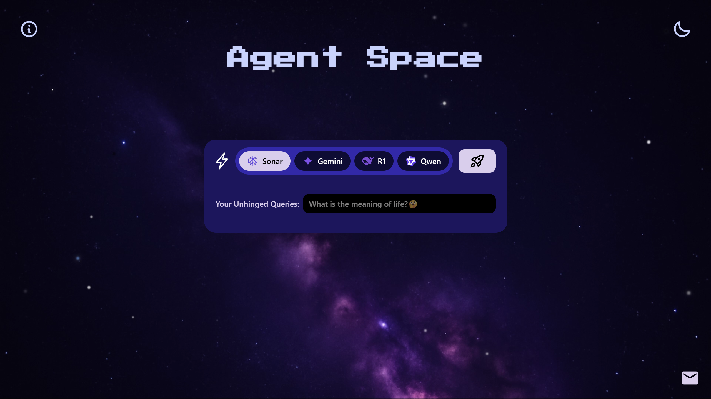

# 🌌 Agent Space

**Agent Space** is an interstellar, full-stack conversational playground for chatting with advanced AI agents. Enjoy a galaxy-inspired UI, smooth user experience, and an animated starfield background.

&nbsp;

## 🚀 Features

- **Conversation Modes:**
  - 📝 **One-liner mode:** stateless, no memory or context
  - 💬 **Conversation mode:** stateful, with memory and context awareness
- **Multi-agent chat** support
- **Pluggable AI Agents** (Perplexity, Gemini, Claude, etc.)
- **Intuitive Chat UI** with animated galaxy/starfield background
- **Lightning-fast** response loop with loading animations
- **Customizable Color Theme:** edit colors & gradients in `tailwind.config.js`
- **Modern stack:** FastAPI (Python) + React + Vite + Tailwind CSS
- **Dark mode toggle**
- **Extended LLM integrations** (plug in additional providers easily)

&nbsp;

## 📸 Preview



&nbsp;

## 🛠️ Tech Stack

- **Frontend:** React 19, Vite, Tailwind CSS, animated starfield with custom palette
- **Backend:** FastAPI (Python), async agent classes, pluggable LLM
- **APIs:** Pluggable with Perplexity, Gemini, Deepseek and more
- **Conversation Modes:**
  - 📝 One-liner (stateless, no memory)
  - 💬 Conversation (stateful, with memory + context)
- **Infrastructure & Deployment:**
  - AWS **EC2** for hosting containers
  - **Elastic Load Balancer (ELB)** for traffic distribution
  - **Elastic IP** for stable addressing
  - **Amazon Certificate Manager (ACM)** for SSL/TLS (integrated with ALB)
  - **Amazon SES** for feedback email handling
  - **Spaceship** domain configuration
  - Dockerized frontend & backend images deployed via GitHub Actions
- **CI/CD:**
  - GitHub Actions workflow at `.github/workflows/CI/CD Pipeline`
  - Builds & pushes Docker images to Amazon ECR
  - Secure deployment to EC2 over SSH (with ACM-managed certificate)
- **Version Control:** Git + GitHub

&nbsp;

## 🪐 Getting Started

### Requirements

- **Node.js** 18+
- **Python** 3.10+

### Frontend Setup

```bash
cd frontend
npm install
npm run dev
```

### Backend Setup

```bash
cd backend
python -m venv venv
source venv/bin/activate  # On Windows: venv\Scripts\activate
pip install -r requirements.txt
cp .env.example .env      # Add your API keys!
uvicorn main:app --reload
```

- Visit http://localhost:5173
- Make sure FastAPI runs at http://localhost:8000.

&nbsp;

## 🎨 Customization

- **Edit palette:** `tailwind.config.js`
- **Starfield:** Tweak `components/StarField.jsx` for star density, colors, movement.
- **Add new agent:** Drop a class in `backend/agents/` and add a FastAPI route.

&nbsp;

## ⚡ Project Structure

- -/agent-space /frontend /components /pages tailwind.config.js postcss.config.js ...
- -/agentspace /backend /agents main.py ...

&nbsp;

## 🤖 Inspiration

The design and visual palette of Agent Space are directly inspired by authentic astronomical photography.  
My primary UI gradient and galaxy backdrop take cues from [this image of a Nebula by Kitt Peak National Observatory](https://kpno.noirlab.edu/images/noao0126a/):

> pairing advanced AI with the wonder of the observable universe.\_

&nbsp;

## ✨ Credits

- **Starfield:** custom React, inspired by [tsparticles](https://github.com/matteobruni/tsparticles)
- **Color palette:** [colormind.io](http://colormind.io/) + custom galaxy tweaks

&nbsp;

## 🚀 Roadmap

- User **access** & **session** management
- Support for **custom models** (self-hosted or fine-tuned)
- **Auto-detect & route to best model** per query (based on latency, context size, or cost)
- Improved **context management** (summarization, vector store, adaptive memory)
- Advanced observability (metrics, logging, monitoring)
- Optional scaling with AWS ECS / Kubernetes

&nbsp;

## 🏗️ CI/CD & Deployment (pipeline)

This repository also includes a **production-ready CI/CD pipeline**, but it is **optional** and primarily intended for maintainers running live deployments.  
Contributors and forks do not need to use it to run the project locally.

The pipeline is implemented using **GitHub Actions** and lives at:`.github/workflows/cicd.yml`

- The pipeline builds Docker images for the frontend and backend, pushes them to Amazon **Elastic Container Registry (ECR)**, and deploys containers to an **Elastic Compute Cloud(EC2)** instance via SSH.
- Traffic is served through an **Application Load Balancer (ALB)** that uses a TLS certificate managed by **Amazon Certificate Manager (ACM)** for HTTPS.

### 📊 Pipeline Overview


### 📂 Where the config lives

- Workflow file: `.github/workflows/cicd.yml`

### ⚙️ What the workflow does

- **Triggers:** runs on `push` and `pull_request` events targeting the `main` branch.
- **Workflow-level env:** declares `AWS_REGION`, `FRONTEND_ECR_REPOSITORY`, and `BACKEND_ECR_REPOSITORY`.
- **Checkout:** checks out repository code with `actions/checkout@v4`.
- **AWS credentials:** configures AWS credentials using `aws-actions/configure-aws-credentials@v2`.
- **ECR login:** logs into Amazon ECR via `aws-actions/amazon-ecr-login@v2`.
- **Build & push frontend:** builds the frontend Docker image in `./frontend` and pushes it to ECR tagged with `${{ github.sha }}`.
- **Build & push backend:** builds the backend Docker image in `./backend` and pushes it to ECR tagged with `${{ github.sha }}`.
- **Deploy to EC2 over SSH:**
- Ensures a Docker network `my-app-network` exists.
- Authenticates Docker on EC2 with ECR (`aws ecr get-login-password`).
- Pulls updated backend and frontend images.
- Removes old containers and redeploys (`backend` on port `8000`, `frontend` on port `80`).
- Injects required environment variables into the backend container (AWS creds, SES, API keys).

### 🔑 Configuration & Secrets

The workflow references GitHub Secrets (**must be stored in GitHub Secrets — never commit them**):

- `AWS_ACCESS_KEY_ID`, `AWS_SECRET_ACCESS_KEY`
- `EC2_HOST`
- `EC2_SSH_KEY` (for connecting to the EC2 instance)
- `SES_SENDER`, `SES_RECIPIENT`
- `GOOGLE_API_KEY`, `OPENROUTER_API_KEY`, `PERPLEXITY_API_KEY`

> ⚠️ **Security Note:** SSH private keys are stored in GitHub Secrets. TLS certificates are managed separately by ACM and attached to the ALB.

### 🌐 Infrastructure Components

- **EC2:** runs the Dockerized frontend and backend containers.
- **ALB (Application Load Balancer):** routes incoming traffic to the EC2 instance(s).
- **ACM (Amazon Certificate Manager):** issues and manages the SSL/TLS certificate bound to the ALB, enabling secure HTTPS connections for your domain.
- **Elastic IP (EIP):** optional; used if exposing an EC2 instance directly. With ALB, DNS points to the ALB instead.
- **Domain (purchased from Spaceship):** domain points to the ALB via DNS (Route 53 or your registrar).
- **Mail server / SES:** backend uses SES with `SES_SENDER` and `SES_RECIPIENT` for feedback emails.

### 🔐 SSH configuration

- The GitHub Actions workflow connects to EC2 via SSH using the `appleboy/ssh-action`.
- The private key is stored securely in GitHub Secrets (`EC2_SSH_KEY`).
- ACM is **not** used for SSH — it is only used to manage TLS for the ALB.

&nbsp;

## 🙋 Questions?

Open an issue, fork the repo, or launch your own cosmic agent!

&nbsp;

> 💫 _May your prompts always find their light in the cosmic void._
