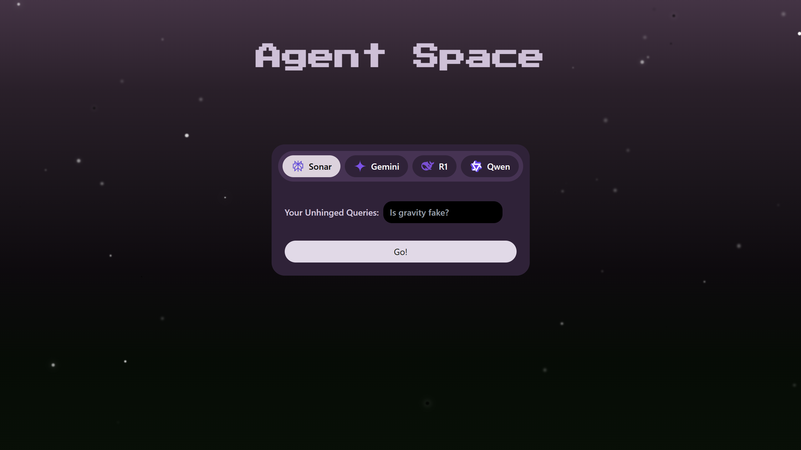

# 🌌 Agent Space

**Agent Space** is an interstellar, full-stack conversational playground for chatting with advanced AI agents. Enjoy a galaxy-inspired UI, smooth user experience, and an animated starfield background.

&nbsp;

## 🚀 Features

- **Intuitive Chat UI** with animated galaxy/starfield background
- **Pluggable AI Agents** (Perplexity, Gemini, Claude, etc.)
- **Lightning-fast** response loop with loading animations
- **Customizable Color Theme:** edit colors & gradients in `tailwind.config.js`
- **Modern stack:** FastAPI (Python) + React + Vite + Tailwind CSS

&nbsp;


## 📸 Preview



&nbsp;


## 🛠️ Tech Stack

- **Frontend:** React 19, Vite, Tailwind CSS, animated starfield with custom palette
- **Backend:** FastAPI, async agent classes, extendable backend for any LLM agent
- **APIs:** Pluggable with Perplexity, Gemini, and more

&nbsp;


## 🪐 Getting Started

### Requirements

- **Node.js** 18+
- **Python** 3.10+

### Frontend Setup
```bash
cd frontend
npm install
npm run dev
```

### Backend Setup
```bash
cd backend
python -m venv venv
source venv/bin/activate  # On Windows: venv\Scripts\activate
pip install -r requirements.txt
cp .env.example .env      # Add your API keys!
uvicorn main:app --reload
```
- Visit http://localhost:5173
- Make sure FastAPI runs at http://localhost:8000.

&nbsp;

## 🎨 Customization

- **Edit palette:** `tailwind.config.js`
- **Starfield:** Tweak `components/StarField.jsx` for star density, colors, movement.
- **Add new agent:** Drop a class in `backend/agents/` and add a FastAPI route.

&nbsp;


## ⚡ Project Structure
- -/agent-space /frontend /components /pages tailwind.config.js postcss.config.js ... /backend /agents main.py ...

&nbsp;


## 🤖 Inspiration

The design and visual palette of Agent Space are directly inspired by authentic astronomical photography.  
My primary UI gradient and galaxy backdrop take cues from [this image of a Nebula by Kitt Peak National Observatory](https://kpno.noirlab.edu/images/noao0126a/):

>pairing advanced AI with the wonder of the observable universe._

&nbsp;


## ✨ Credits

- **Starfield:** custom React, inspired by [tsparticles](https://github.com/matteobruni/tsparticles)
- **Color palette:** [colormind.io](http://colormind.io/) + custom galaxy tweaks

&nbsp;


## 🚀 Roadmap

- [ ] Conversation history
- [ ] Dark mode toggle
- [ ] Multi-agent chat
- [ ] Plug in more LLMs!

&nbsp;


## 🙋 Questions?

Open an issue, fork the repo, or launch your own cosmic agent!

&nbsp;

> 💫 _May your prompts always find their light in the cosmic void._
